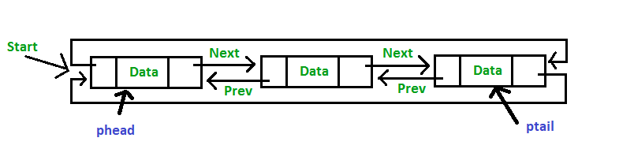

<center>
<h1>
In The Name Of ALLAH
</h1>
<h2>
Advanced Programming - Homework 4
</h2>
<h2>
Dr.Amir Jahanshahi
</h2>
<h3>
Deadline: Wednesday, 3 Ordibehesht - 23:00
</center>
  
#  Introduction
In this exciting homework, you're going to implement a special **data structure** for the AP course. We've decided to have a second midterm exam, but due to the limits of resources, unfortunately, it isn't possible to take the exam from all the students. So we need to select only a few of our dear students to take the exam. We need a data structure to select students and we think you are the best people on earth to implement it. Technically speaking, we need a **priority doubly circular linked list** data structure and we're going to specialize it for our course. Let's do it.


#  Student Class
Since we're doing all these efforts for our dear students, it would be respectful if we had a **Student** class. So implement it. This class has the following member variables.

*  
  ```c++
  long id{};
  ```
 Representing the student's id. (private)

*
  ```c++
  double homework{};
  ``` 
Representing the student's homeworks grade. (private)

*
  ```c++
  double midterm_project{};
  ```
Representing the student's midterm project grade. (private)

*
  ```c++
  double midterm_exam{};
  ```
Representing the student's midterm exam grade. (private)

*
  ```c++
  double party{};
  ```
Representing the student's amount of friendship with the TAs! (very private :-))

Besides, it has the following member functions.
*
  ```c++
  Student (long id, double hw, double mid_proj, double mid_exam, double party=50);
  ```
  **Note**: All the data except the homework grades (which are real grades) are generated randomly! So don't be happy!

This constructor gets all informations of a student and creates it's object.

*
  ```c++
  void setID();
  ```

*
  ```c++
  long getID();
  ```

*
  ```c++
  void setHomework{};
  ```

*
  ```c++
  long getHomework();
  ```

*
  ```c++
  void setMidtermProject();
  ```

*
  ```c++
  long getMidtermProject();
  ```

*
  ```c++
  void setMidtermExam();
  ```

*
  ```c++
  long getMidtermExam();
  ```

*
  ```c++
  void setParty();
  ```

*
  ```c++
  void getParty();
  ```

*
  ```c++
  long value();
  ```
This function determines the likelihood of a student to take the exam, called value. This quantity is measured from the below formula.

*
  ```c++
  void show();
  ```
This function displays informations of a student in a beautiful way like below.



*  The following code must work just like the **show()** method you implemented in the last part.

  ``` c++
  std::cout << student << std::endl;
  ```
